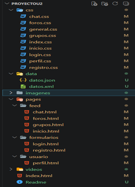

# Daat Devotional

Red social para el estudio y reflexión bíblica. Conecta, aprende y crece espiritualmente en comunidad.

---

## Descripción

**Daat Devotional** es una plataforma web diseñada para cristianos que desean profundizar en el estudio de la Palabra de Dios, compartir reflexiones, participar en foros de discusión y unirse a grupos de estudio bíblico. El nombre "Daat" proviene del hebreo y significa "conocimiento", reflejando el propósito de la plataforma: crecer en el conocimiento de Dios y Su Palabra.

La plataforma permite a los usuarios:
- Compartir reflexiones y versículos bíblicos
- Unirse a grupos de estudio temáticos
- Participar en foros de discusión
- Chatear con otros creyentes
- Conectar con una comunidad de fe

---

## Objetivo

Crear un espacio digital donde los creyentes puedan:
- **Conectar** con otros estudiantes de la Biblia
- **Aprender** a través del estudio comunitario
- **Compartir** reflexiones y testimonios
- **Crecer** espiritualmente en comunidad

---

## Tecnologías utilizadas

| Tecnología | Descripción |
|------------|-------------|
| **HTML5** | Estructura semántica de las páginas |
| **CSS3** | Estilos personalizados (mobile-first) |
| **Bootstrap 5.3.8** | Framework CSS para componentes y grid |
| **Font Awesome 6.5.0** | Iconos vectoriales |
| **JSON** | Representación de datos estructurados |
| **XML** | Representación alternativa de datos |

---

## Estructura de carpetas



---

## Páginas disponibles

| Página | Ruta | Descripción |
|--------|------|-------------|
| **Inicio** | `index.html` | Página de bienvenida con presentación, tarjetas de servicios, preguntas frecuentes y estadísticas |
| **Login** | `pages/formularios/login.html` | Formulario de inicio de sesión |
| **Registro** | `pages/formularios/registro.html` | Formulario de registro de usuarios |
| **Feed** | `pages/feed/inicio.html` | Publicaciones, reflexiones y carrusel de noticias |
| **Grupos** | `pages/feed/grupos.html` | Lista de grupos de estudio bíblico |
| **Foros** | `pages/feed/foros.html` | Foros de discusión sobre temas bíblicos |
| **Chat** | `pages/feed/chat.html` | Sistema de mensajería entre usuarios |
| **Perfil** | `pages/usuario/perfil.html` | Perfil de usuario con publicaciones y galería |

---

## Componentes Bootstrap utilizados

| Componente | Ubicación | Descripción |
|------------|-----------|-------------|
| **Navbar** | Todas las páginas | Navegación principal con botones |
| **Grid System** | Todas las páginas | Layout responsivo (container, row, col) |
| **Buttons** | Todas las páginas | Botones estilizados (btn, btn-primary, btn-light, btn-outline-primary) |
| **Cards** | `inicio.html`, `grupos.html`, `foros.html` | Tarjetas para mostrar contenido |
| **Carousel** | `inicio.html` | Carrusel de imágenes y videos de noticias |
| **Accordion** | `index.html` | Preguntas frecuentes |
| **Forms** | `login.html`, `registro.html` | Formularios con controles de Bootstrap |
| **Alerts** | - | (Preparado para futuros mensajes) |
| **Badges** | - | (Preparado para futuras etiquetas) |
| **Progress** | `index.html` | Barras de progreso en estadísticas |
| **Meter** | `index.html` | Medidores en estadísticas |
| **Disabled** | `grupos.html`, `foros.html` | Botones desactivados en filtros |

---

## Instrucciones para ejecutar el proyecto

### Opción 1: Usar Live Server (Recomendado)

1. **Clonar o descargar** el repositorio
2. **Instalar** la extensión "Live Server" en Visual Studio Code
3. **Abrir** el proyecto en Visual Studio Code
4. **Hacer clic derecho** sobre `index.html` y seleccionar "Open with Live Server"
5. El proyecto se abrirá en tu navegador en `http://127.0.0.1:5500/`

### Opción 2: Abrir directamente

1. Navega a la carpeta del proyecto
2. Haz doble clic en `index.html`
3. El proyecto se abrirá en tu navegador predeterminado

## Archivos de Datos (JSON y XML)

### `data/datos.json` - Publicaciones del Feed

Este archivo representa la estructura de las publicaciones que aparecen en el feed de inicio. Cada publicación contiene:

```json
[
  {
    "id": 1,
    "autor": "María González",
    "usuario": "@maria_g",
    "fecha": "Hace 2 horas",
    "contenido": "Reflexionando sobre el amor de Dios esta mañana...",
    "versiculo": {
      "texto": "Porque de tal manera amó Dios al mundo...",
      "referencia": "Juan 3:16"
    },
    "acciones": {
      "me_gusta": 24,
      "comentarios": 8
    }
  }
]
```

**Relación con la interfaz:** Las publicaciones se muestran como tarjetas en el feed de inicio, con el contenido, versículo, referencias y acciones (me gusta, comentarios, compartir).

### `data/datos.xml` - Grupos de Estudio

Este archivo representa la estructura de los grupos de estudio disponibles en la plataforma:

```xml
<?xml version="1.0" encoding="UTF-8"?>
<grupos>
    <grupo>
        <id>1</id>
        <nombre>Estudio de los Evangelios</nombre>
        <descripcion>Estudiamos en profundidad los cuatro evangelios...</descripcion>
        <miembros>234</miembros>
        <etiqueta>Nuevo Testamento</etiqueta>
        <estado_miembro>Abandonar</estado_miembro>
        <color_banner>card-banner-1</color_banner>
    </grupo>
</grupos>
```

**Relación con la interfaz:** Los grupos se muestran como tarjetas en la página de grupos, con nombre, descripción, número de miembros, etiqueta y botones de acción (abandonar/unirse).

### Uso futuro

En una etapa posterior, estos archivos podrían ser reemplazados por una base de datos real o una API REST que proporcione los datos dinámicamente desde un servidor. Por ahora, los datos están simulados dentro del HTML para representar cómo se estructuraría la información.

---

## Autor

- **Nombre:** [Jhon Herrera]
- **Proyecto:** Daat Devotional
- **Fecha:** Junio 2026
- **Curso:** Desarrollo Web / Programación